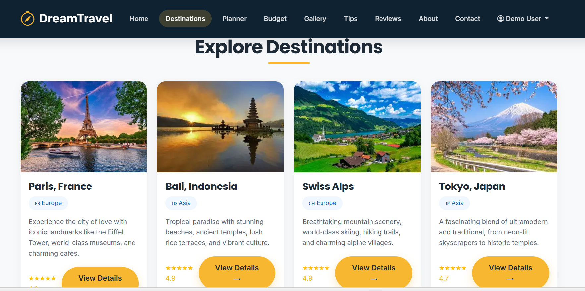
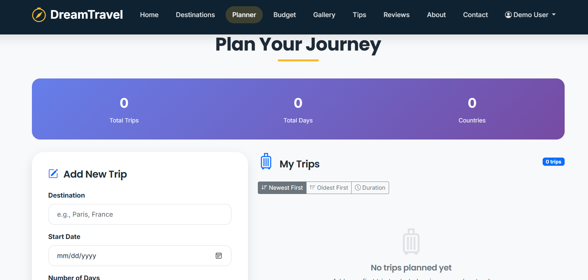
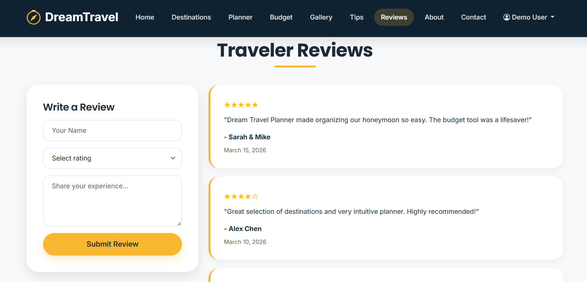

# ✈️ Dream Travel Planner

🚀 A responsive travel planning web app with budget tracking and destination exploration features.

Dream Travel Planner is a frontend web application that helps users explore travel destinations, plan trips, and manage travel budgets — all in one place.

---

## 🚀 Features

* 🌍 Explore popular travel destinations
* 🗓️ Plan trips with dates and duration
* 💰 Track travel expenses and manage budget
* 🖼️ View destination images in a gallery
* ⭐ Read and submit traveler reviews
* 📱 Fully responsive design (mobile, tablet, desktop)

---

## 📸 Screenshots

### 🏠 Home Page


### 🌍 Destinations Page



### 🗓️ Trip Planner



### ⭐ Reviews Page



---

## 🛠 Technologies Used

* HTML5
* CSS3
* Bootstrap 5
* JavaScript (ES6)
* LocalStorage API

---

## ▶️ How to Run Locally

1. Clone the repository

   ```
   git clone https://github.com/DishaAgarwalla/Dream-Travel-Planner.git
   ```

2. Navigate to the project folder

   ```
   cd Dream-Travel-Planner
   ```

3. Open `index.html` in your browser

---

## 📌 Repository

👉 https://github.com/DishaAgarwalla/Dream-Travel-Planner

---

## 💡 Future Enhancements

* 🔐 Add user authentication (login/signup)
* 🌐 Integrate real-time travel APIs
* 🗺️ Add map integration (Google Maps)
* ☁️ Enable cloud-based data storage

---

## 🙌 Acknowledgements

This project was built as part of learning and practicing frontend web development and improving UI/UX design skills.

---
👨‍💻 Author
Disha Agarwalla


## 📬 Contact

If you’d like to connect or collaborate, feel free to reach out!

---
